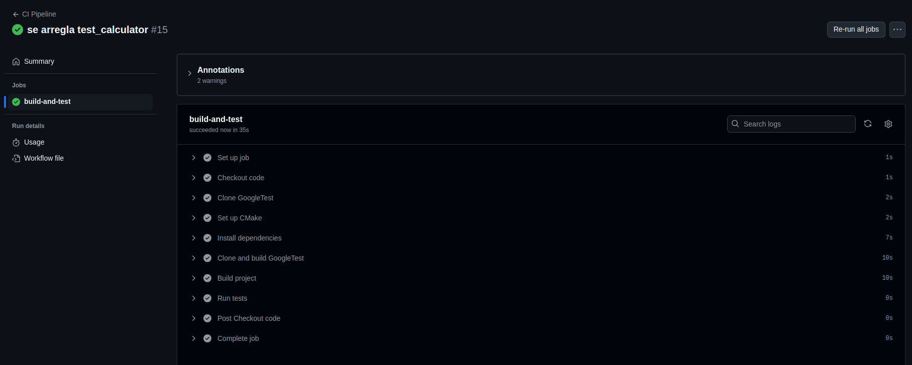
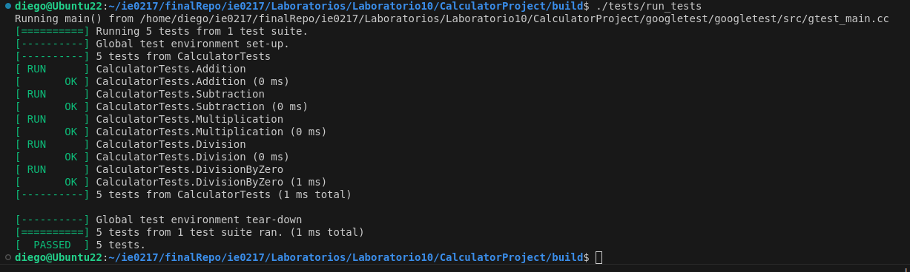

# Laboratorio 10: Software Testing

Utilizando Github Actions se debuggean los scripts referentes a una calculadora. En la imagen siguiente se nota el proceso exitoso:

Luego, al clonar el repositorio de googletest, se corre localmente la parte de debuggeo, la cual finaliza de maera exitosa.

