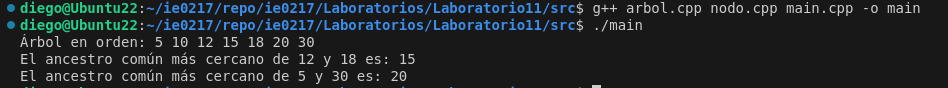

# Laboratorio 11/Extra IE-0217

Se documenta un código acerca de árboles binarios y se divide en headerfiles y main.
Se crea una carpeta `src` la cual contiene los headerfiles y archivos fuente, nombrados todos en la siguiente lista:
- `nodo.hpp`
- `nodo.cpp`
- `arbol.cpp`
- `arbol.hpp`
- `main.cpp`

Se pueden correr los archivos, desde la terminal, al situarse en la carpeta raíz _Laboratorio11_ con el siguiente comando:

```bash
g++ arbol.cpp nodo.cpp main.cpp -o main
```

Al correr el sistema con ese comando se obtiene el siguiente resultado:

