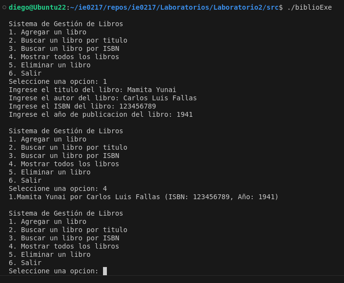

# ie0217 Laboratorio 2

En este laboratorio se trabajan los conocimientos de C++ adquiridos en la sesion 2 y 3. Se crea una biblioteca, la cual permite añadir libros a una lista, donde cada libro contiene su propia información: _título, autor, ISBN y año de publicación_. La manera de accesar a cada opcion es mediante un menú, el cual contiene 5 opciones: _Agregar un libro, Buscar un libro por título, Buscar un libro por ISBN, Mostrar todos los libros, Eliminar un libro y Salir del menú_. El menú funcionando en terminal se puede observar en la siguiente imagen, así como el ejemplo de la opción 1 y opción 4:



## Ejecución del Código

### Prerrequisitos
- Asegúrese de tener instalado `make`.
- Debe estar en la carpeta raíz del proyecto donde se encuentra el `Makefile`, la cual es "Laboratorio2".

### Compilación
Note que el sistema operativo que se está usando es Ubuntu 22.04. Para compilar el proyecto, simplemente ejecuta los siguientes comandos en la terminal:

```
make
g++ main.cpp funciones.cpp -o biblioEjecutable
./biblioEjecutable
```
