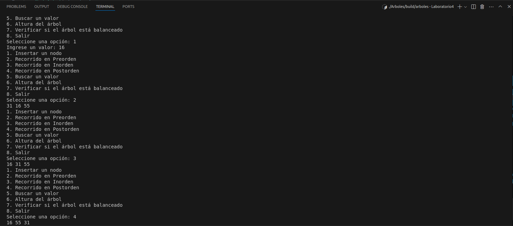
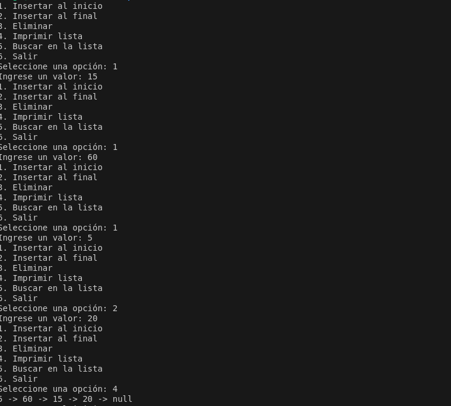

# IE0217 Laboratorio 4

El laboratorio trató de la creación de dos códigos: uno enfocado alrededor de listas enlazadas y uno enfocado alrededor de árboles binarios. Una _lista enlazada_ es una estructura de datos lineal que incluye una serie de nodos conectados. Cada nodo almacena los datos y la dirección del siguiente nodo. Por otra parte, un _árbol_ es una estructura de datos jerárquica no lineal que consta de nodos conectados por aristas.

La manera correcta de recorrer un arbol binario es, en cada nodo, revisar las condiciones con los valores de los nodos de la rama derecha y de la ziquierda. Sabemos que los **nodos** solo contienen 3 elementros: el valor actual, un puntero hacia la izquierda y un puntero hacia la derecha. 

## Funcionamiento del código de Árboles

Para este código se programa un script capaz de crear árboles binarios, así como recorrerlos, verificar sus estadísticas y su altura; todo esto a partir de un menú interactivo con el usuario. Para este ejemplo de funcionamiento, se ingresaron tres nodos: 31, 55 y 16; luego, se probaron varias opciones. El funcionamiento en consola es el siguiente:



### Cómo correr los códigos

Para correr los códigos, facilita el trabajo estar en la carpeta respectiva para cada ejercicio. En este caso, luego de situarnos en la carpeta raíz del laboratorio (Laboratorio4), debemos estar en la carpeta 'Arboles'. A continuación se muestran los comandos que se deben poner en consola, considerando que el archivo ejecutable que se creará se llamará _arboles_. También cabe destacar que el laboratorio se trabajó en Ubuntu 22.04.

```
cd Arboles/
g++ -o build/arboles src/main.cpp
./build/arboles
```


## Funcionamiento del código de Listas

Para este código se programa un script capaz de crear listas enlazadas de tamaño dinámico, de manera que se puede añadir un elemento al inicio y al final de la lista. Además, se pueden eliminar elementos de la lista y recorrer la lista para encontrar algún valor en específico. Todo esto le es disponible al usuario a través de un menú prinicpal, desde el cual también puede imprimir la lista en pantalla o salir del programa. El funcionamiento en terminal se muestra a continuación:



### Cómo correr los códigos

Para correr los códigos, facilita el trabajo estar en la carpeta respectiva para cada ejercicio. En este caso, luego de situarnos en la carpeta raíz del laboratorio (Laboratorio4), debemos estar en la carpeta 'Listas'. A continuación se muestran los comandos que se deben poner en consola, considerando que el archivo ejecutable que se creará se llamará _listas_. También cabe destacar que el laboratorio se trabajó en Ubuntu 22.04.

```
cd Listas/
g++ -o build/listas src/main.cpp
./build/listas
```