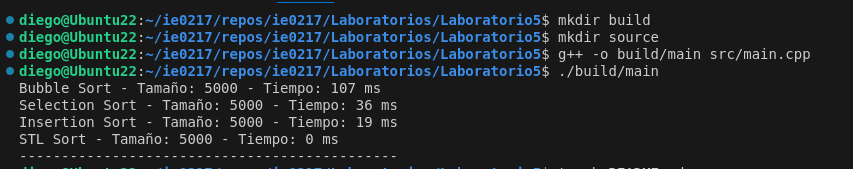

# IE0217 Laboratorio 5

El laboratorio trató sobre separar en headerfile y archivo fuente un script referente al uso de distintos algoritmos de ordenamiento para probar los distintos tiempos de ejecución de cada uno, creando un vector aleatorio para que sea ordenado.

Primero se crean dos directorios: _src_ para el código fuente y _build_ para el ejecutable. Se ve cómo corrió en las siguientes imágenes:



Ahora para iterar 5k, 10k, 20k, 30k, 40k y 50k se obtuvo lo siguiente:


En clase se creó una gráfica desde una hoja de cálculo, para así poder comparar el tiempo de ejecución de cada algoritmo de una manera más sencilla:


## Ejecución del Código

### Prerrequisitos
- Asegúrese de estar situado en la carpeta raíz 'Laboratorio5'.
- Tener instalado el compilador de C++

### Compilación
Note que el sistema operativo que se está usando es Ubuntu 22.04. Para compilar el proyecto, simplemente ejecuta los siguientes comandos en la terminal:

```
g++ src/main.cpp src/sorting.cpp -o build/main 
./build/main
```


