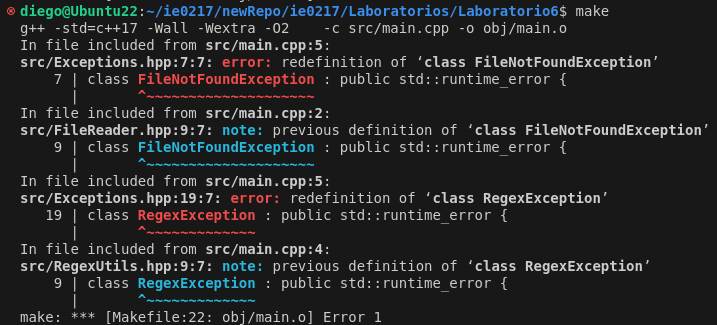
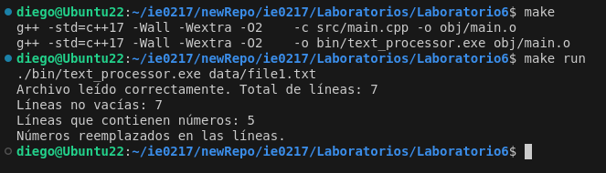

# IE0217 Laboratorio 6

El laboratorio trató sobre depurar un error de redefinición de una clase. El error se ve a continuación



El error se solucionó al eliminar las clases FileNotFoundException y RegexException del archivo Exceptions.hpp. El error se debía a que esas clases estaban definidas tanto en el archivo Exceptions.hpp, como en otros headerfiles, y luego en el archivo main se incluían los tres headerfiles distintos, por lo que el main captaba que había más de una sola definición para esas clases.

Al debuggear, el código debería correr correctamente de la siguiente manera:



## Ejecución del Código

### Prerrequisitos
- Asegúrese de estar situado en la carpeta raíz 'Laboratorio6'.
- Tener instalado el compilador de C++

### Compilación
Note que el sistema operativo que se está usando es Ubuntu 22.04, sin embargo el Makefile está hecho para poder compilar y correr en Windoes también. Para compilar el proyecto, simplemente ejecuta los siguientes comandos en la terminal:

```
make run
```

Esto compila y corre el script; sin embargo, si solo se desea compilar, se puede solo usar el comando 'make'

```
make
```
