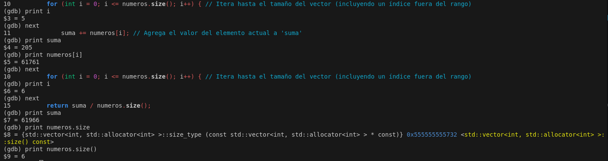
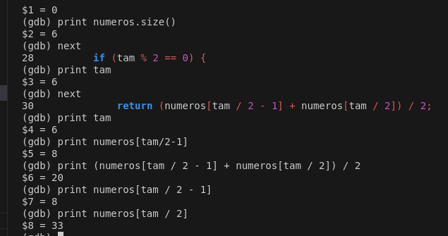
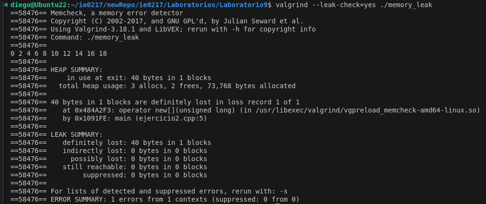
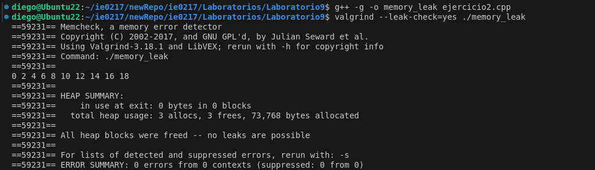
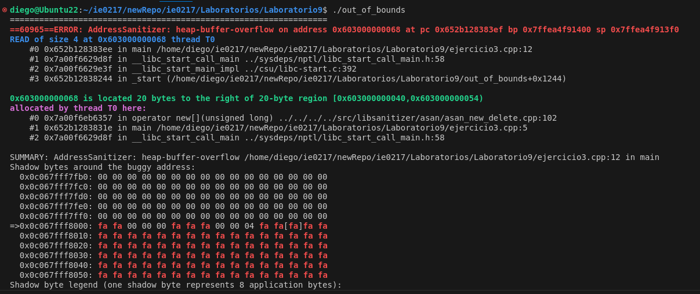
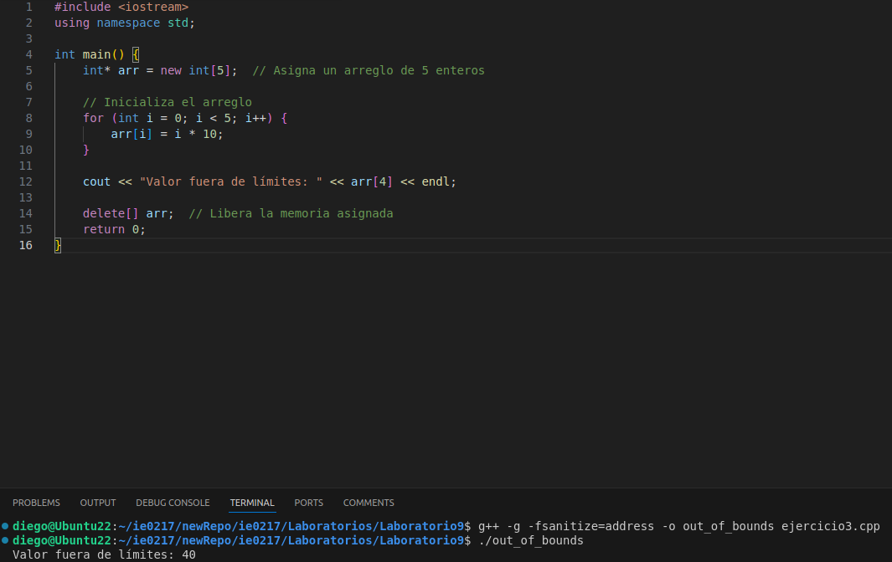
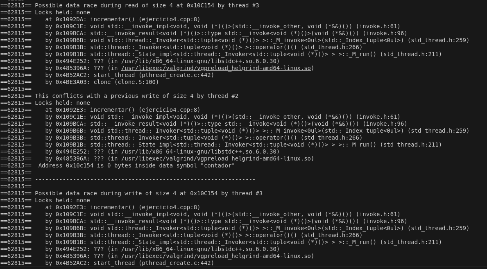
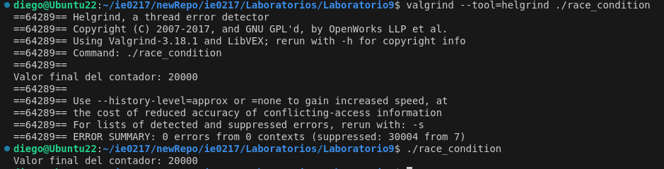

# Laboratorio 9: Depuración de errores

Para este lab se hacen varios ejercicios referentes al uso de herramientas de depuración. 

## Ejercicio 1

Para el primer ejercicio, se tiene el primer error es un problema con el manejo del iterador del _for_ detro de la función **calcularMedia**, ya que este dice que el iterador _i_ puede ser menor o **igual** al tamaño del vector de números, sin embargo, lo que se maneja es tamaño-1, por lo que el bucle se itera una vez de más y el iterador intenta acceder a números fuera del rango.


```cpp
for (int i = 0; i < numeros.size(); i++)
```


También, para esta función, se prevee que cuando **suma** no sea divisible entre **numeros.size()**, el programa va a aproximar el número ya que la variable suma es de tipo entero. La solución a esto es cambiar el tipo de variable de suma a tipo double.

```cpp
double suma;
```

En la segunda función, se nota el siguiente error:



Debido a que 41%2 no es 0, el sistema aproxima el verdadero resultado, ya que (33+8)/2 debería ser 20.5; pero el sistema o aproxima a 20. Para solucionar este error, se le dice explícitamente al script que trabaje con decimal, dividiendo entre 2.0 en lugar de 2; como se nota en la corrección siguiente:

```cpp
return (numeros[tam / 2 - 1] + numeros[tam / 2]) / 2.0;
```

## Ejercicio 2

Este ejercicio presenta un error de fuga de memoria, como se muestra en la siguiente imagen gracias a la herramienta Valgrind.



Para esto, se corrige al añadir un _delete_ para liberar la memoria utilizada, como se muestra en el siguiente código, y luego ya Valgrind nos dice que todo está bien.
```cpp
delete[] arr;
```



## Ejercicio 3

Para este ejercicio ocurre un error de acceso de fuera de límites, como se muestra en la siguiente imagen:





Ya que el arreglo solo va de 0 a 4, se genera un error ya que se le pide al script imprimir el décimo elemento del arreglo al código, pero este no tiene tantos. Para esto, solo se le pide que imprima un elemento que sí está presente, y el código se arregla y corre correctamente.



## Ejercicio 4 y 5

Para este código se presenta un error de condición de carrera, ya que en al función donde se usa el contador no se utiliza un mutex para evitar que ambs hilos funcionen al mismo tiempo y se pierdan datos, como se ve en la siguiente imagen.



Luego a la función para incrementar solo se le añade un mutex lock, como se ve en el código siguiente, y ya las herramientas depuradoras de errores se dejan de quejar.

```cpp
void incrementar() {
    for (int i = 0; i < 10000; i++) {
       lock_guard<mutex> lock(mtx);
       contador++;
    }
}
```



