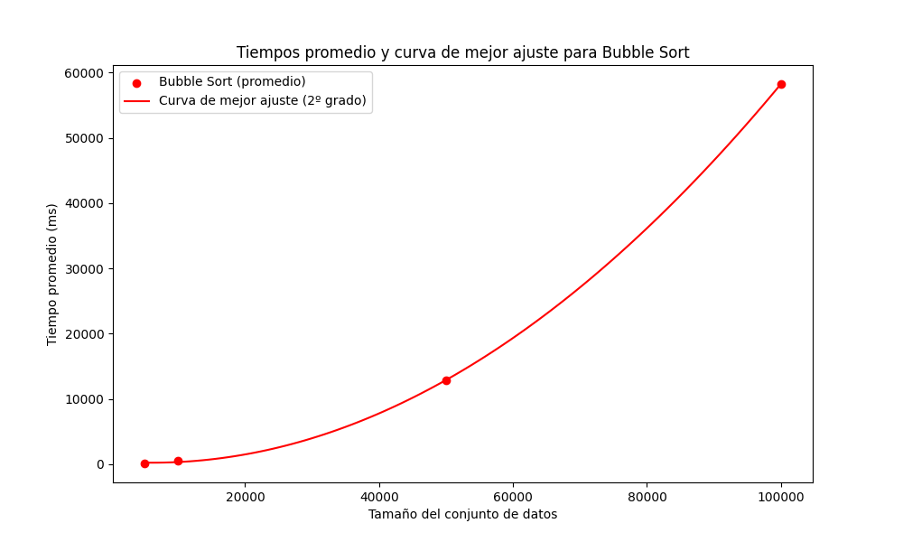
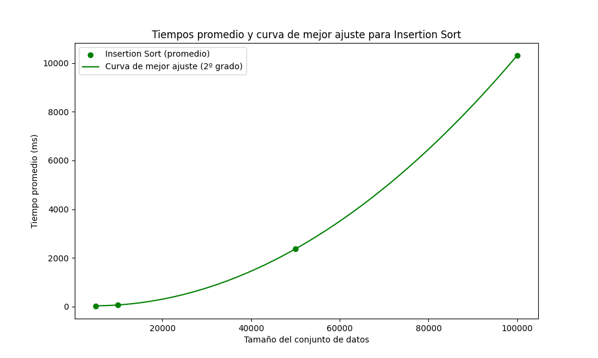
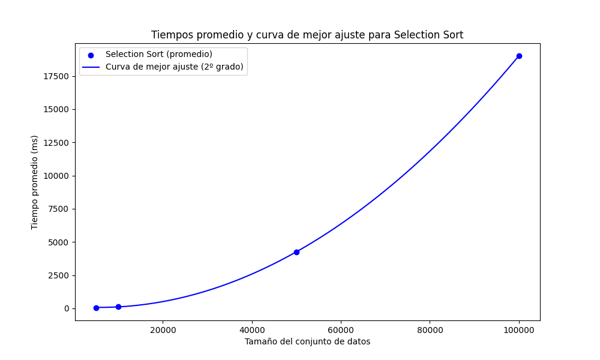
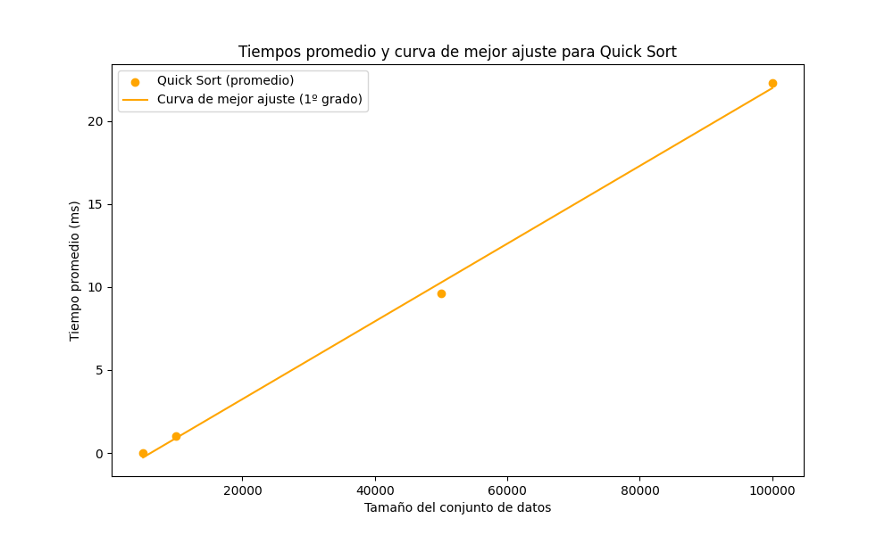
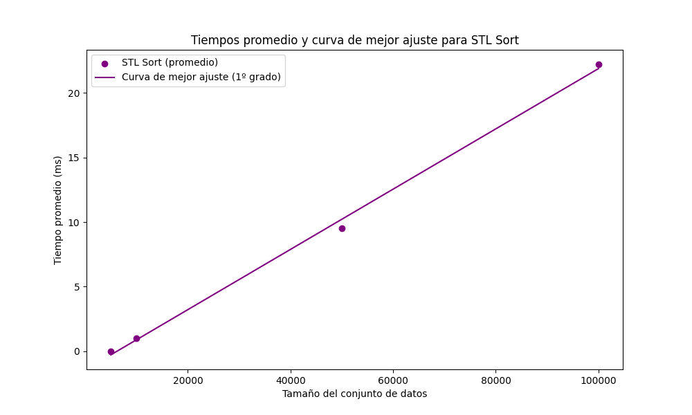

# IE0217 Tarea 4

Para esta tarea se realiza un script para probar los distintos algoritmos de ordenamiento comunes, vistos en clase. Se prueba cada algoritmo con vectores de 1000, 5000, 10000, 50000, 10000, 200000 y 500000 entradas. Luego, se corre els cript 10 veces y guardan los resultados en un archivo CSV, el cual se grafica con el script de Python que está en la carpeta raíz. 

## Cómo correr el código

El primer paso es tener instalado el compilador G++ paraAhora bien, para correr el código primero hay que estar en la carpeta raíz 'Tarea4'. Luego, solo es necesario poner los siguientes comandos en la terminal:

Si se quiere correr solo una iteración con todos los tamaños de los vectores, se usa:
```
make
```

Asimismo, si se desea realizar las 10 iteraciones del código y gaurdar los resultados en un archivo CSV, entonces se usa:
```
make 10
```

## Resultados del código corrido

A continuación se ven los resultados grafiados al hacer 10 iteraciones del script, para todos los algoritmos de ordenamiento y con semillas distintas para los vectores. Por razones de poder de computación y tiempo, solo se grafica hasta 100k.












# Parte Teórica

## 1. ¿Qué es un algoritmo de ordenamiento y por qué son importantes en programación?

Un **algoritmo de ordenamiento** es un procedimiento paso a paso que organiza los elementos de una colección, como un arreglo o lista, en un orden específico, usualmente en orden ascendente o descendente. Son importantes porque:

- Facilitan búsquedas más rápidas.
- Permiten organizar datos eficientemente para su posterior uso.
- Son fundamentales en muchas aplicaciones, como bases de datos, sistemas operativos, y procesamiento de datos.


[Referencia](https://mv1.mediacionvirtual.ucr.ac.cr/pluginfile.php/3083145/mod_resource/content/0/Algoritmos%20de%20ordenamiento.pdf)
## 2. Explique el funcionamiento del algoritmo de ordenamiento "Bubble Sort".

**Bubble Sort** es un algoritmo que recorre repetidamente la lista a ordenar, comparando elementos adyacentes e intercambiándolos si están en el orden incorrecto. El proceso se repite hasta que no se necesitan más intercambios.

Pseudocódigo:

```cpp
void bubble_sort(vector<int>& arr) {
    bool swapped;
    for (int i = 0; i < arr.size()-1; i++) {
        swapped = false;
        for (int j = 0; j < arr.size()-i-1; j++) {
            if (arr[j] > arr[j+1]) {
                swap(arr[j], arr[j+1]);
                swapped = true;
            }
        }
        if (!swapped) break;
    }
}
```

[Referencia](https://mv1.mediacionvirtual.ucr.ac.cr/pluginfile.php/3083145/mod_resource/content/0/Algoritmos%20de%20ordenamiento.pdf)

## 3. Explique el funcionamiento del algoritmo de ordenamiento "Selection Sort".

**Selection Sort** divide el arreglo en una parte ordenada y otra no ordenada. En cada iteración, selecciona el elemento más pequeño de la parte no ordenada y lo coloca en la posición correcta.

Pseudocódigo:

```cpp
void selection_sort(vector<int>& arr) {
    for (int i = 0; i < arr.size()-1; i++) {
        int min_idx = i;
        for (int j = i+1; j < arr.size(); j++) {
            if (arr[j] < arr[min_idx]) {
                min_idx = j;
            }
        }
        swap(arr[i], arr[min_idx]);
    }
}
```
[Referencia](https://mv1.mediacionvirtual.ucr.ac.cr/pluginfile.php/3083145/mod_resource/content/0/Algoritmos%20de%20ordenamiento.pdf)

## 4. Describa el algoritmo de ordenamiento "QuickSort". ¿Cuál es su ventaja principal sobre otros algoritmos de ordenamiento?

**QuickSort** es un algoritmo de ordenamiento de tipo "divide y vencerás". Selecciona un pivote y particiona el arreglo en dos sub-arreglos: uno con los elementos menores que el pivote y otro con los mayores. Luego aplica el mismo proceso recursivamente a cada sub-arreglo.

Ventaja principal: Su complejidad promedio es \(O(n \log n)\), lo que lo hace más eficiente que otros algoritmos, como Bubble Sort y Selection Sort, para grandes volúmenes de datos.

Pseudocódigo:

```cpp
int partition(vector<int>& arr, int low, int high) {
    int pivot = arr[high];
    int i = low - 1;
    for (int j = low; j < high; j++) {
        if (arr[j] < pivot) {
            i++;
            swap(arr[i], arr[j]);
        }
    }
    swap(arr[i+1], arr[high]);
    return i+1;
}

void quick_sort(vector<int>& arr, int low, int high) {
    if (low < high) {
        int pi = partition(arr, low, high);
        quick_sort(arr, low, pi - 1);
        quick_sort(arr, pi + 1, high);
    }
}
```

[Referencia](https://mv1.mediacionvirtual.ucr.ac.cr/pluginfile.php/3083145/mod_resource/content/0/Algoritmos%20de%20ordenamiento.pdf)

## 5. Explique el concepto de complejidad temporal y cómo se aplica a los algoritmos de ordenamiento.

La **complejidad temporal** mide el tiempo de ejecución de un algoritmo en función del tamaño del input, denotado generalmente como \(n\). La complejidad temporal de los algoritmos de ordenamiento es importante porque permite comparar su eficiencia en diferentes casos.

| Algoritmo       | Mejor Caso | Caso Promedio | Peor Caso   |
|-----------------|------------|---------------|-------------|
| Bubble Sort     | O(n)       | O(n²)         | O(n²)       |
| Insertion Sort  | O(n)       | O(n²)         | O(n²)       |
| Quick Sort      | O(n log n) | O(n log n)    | O(n²)       |
| Selection Sort  | O(n²)      | O(n²)         | O(n²)       |
| std::sort (STL) | O(n log n) | O(n log n)    | O(n log n)  |

[Referencia](https://mv1.mediacionvirtual.ucr.ac.cr/pluginfile.php/3083145/mod_resource/content/0/Algoritmos%20de%20ordenamiento.pdf)

## 6. ¿Cuál es la diferencia entre los algoritmos de ordenamiento estables e inestables?

Un algoritmo de ordenamiento es **estable** si mantiene el orden relativo de los elementos con claves iguales. En un algoritmo **inestable**, este orden puede cambiar.

- Ejemplo de algoritmo **estable**: Insertion Sort.
- Ejemplo de algoritmo **inestable**: QuickSort.

La **estabilidad** es importante cuando los elementos tienen atributos secundarios que deben preservarse al ordenar.

[Referencia](https://conclase.net/c/orden)

## 7. ¿Cómo funciona la función `std::sort` de la STL y qué algoritmo de ordenamiento utiliza internamente?

`std::sort` utiliza una combinación de QuickSort, Insertion Sort y HeapSort dependiendo del tamaño del conjunto de datos. Para datos pequeños, utiliza **Insertion Sort**; para datos grandes, utiliza una versión optimizada de **QuickSort** con HeapSort para evitar el peor caso.

### Complejidad
- Mejor caso: \(O(n \log n)\)
- Peor caso: \(O(n \log n)\)

[Referencia](https://conclase.net/c/orden)

## 8. Explique la importancia de hacer benchmarks en los algoritmos de ordenamiento.

Los **benchmarks** permiten medir el rendimiento de diferentes algoritmos de ordenamiento bajo diferentes condiciones, ayudando a:

- Identificar el algoritmo más eficiente para un conjunto de datos específico.
- Evaluar la escalabilidad de un algoritmo.
- Comparar tiempos de ejecución en distintos tamaños de entrada.

Factores a considerar:
- Tamaño del conjunto de datos.
- Orden inicial de los datos.
- Requisitos de estabilidad.

[Referencia](https://conclase.net/c/orden)

## 9. Compare el uso de memoria de diferentes algoritmos de ordenamiento.

| Algoritmo       | Complejidad Espacial |
|-----------------|----------------------|
| Bubble Sort     | O(1)                 |
| Insertion Sort  | O(1)                 |
| Quick Sort      | O(log n)             |
| Selection Sort  | O(1)                 |
| Merge Sort      | O(n)                 |

QuickSort es más eficiente en términos de memoria comparado con Merge Sort, que requiere espacio adicional proporcional al tamaño de la lista.

[Referencia](https://conclase.net/c/orden)

## 10. ¿Cómo se elige el algoritmo de ordenamiento más adecuado para un conjunto de datos dado?

Factores que influyen en la elección:
- Tamaño del conjunto de datos.
- Orden inicial de los datos.
- Requisitos de estabilidad.
- Limitaciones de memoria.

Por ejemplo, **QuickSort** es ideal para grandes conjuntos de datos desordenados, mientras que **Insertion Sort** funciona bien en conjuntos pequeños o casi ordenados.

[Referencia](https://dlopezcastellote.dev/blog/algoritmos-ordenacion-genericos-herencia-c++/)

## 11. Nombre cinco contenedores diferentes de la STL y explique brevemente en qué situaciones sería apropiado usar cada uno.

| Contenedor | Descripción |
|------------|-------------|
| `vector`   | Contenedor dinámico que permite acceso aleatorio. Ideal cuando el tamaño puede variar. |
| `list`     | Lista doblemente enlazada. Útil cuando se requieren inserciones/eliminaciones frecuentes. |
| `deque`    | Contenedor que permite inserciones y eliminaciones rápidas tanto en los extremos como en el medio. |
| `set`      | Contenedor que almacena elementos únicos en orden. Ideal para eliminar duplicados. |
| `map`      | Contenedor de pares clave-valor. Se utiliza para búsquedas rápidas con claves. |

[Referencia](https://www.geeksforgeeks.org/the-c-standard-template-library-stl/)

## 12. Explique qué son los adaptadores de contenedores y brinde un ejemplo para el cual se podría implementar.

Los **adaptadores de contenedores** son estructuras que modifican la interfaz de los contenedores subyacentes. Los tres adaptadores más comunes son `stack`, `queue`, y `priority_queue`.

Ejemplo: `stack` utiliza un `deque` o `vector` para implementar una pila.

[Referencia](https://mv1.mediacionvirtual.ucr.ac.cr/pluginfile.php/3083145/mod_resource/content/0/Algoritmos%20de%20ordenamiento.pdf)

## 13. Explique el concepto de iteradores en la STL y cómo se utilizan para acceder a elementos en contenedores.

Los **iteradores** son objetos que apuntan a elementos dentro de contenedores STL, permitiendo recorrerlos como si fueran punteros.

Tipos de iteradores:
- **Input/Output**: Lectura/escritura de datos.
- **Forward**: Avanzan en una dirección.
- **Bidireccional**: Avanzan y retroceden.
- **Random Access**: Acceso aleatorio (e.g., `vector`).

Ejemplo de uso:

```cpp
vector<int> v = {1, 2, 3, 4};
for (auto it = v.begin(); it != v.end(); ++it) {
    cout << *it << " ";
}
```

[Referencia](https://www.geeksforgeeks.org/the-c-standard-template-library-stl/)

## 14. Mencione y explique 3 diferentes operaciones soportadas por iteradores en STL ¿Cuál es la forma de definirlas en el código?

Operaciones comunes:
1. **Dereferenciación (`*`)**: Obtiene el valor apuntado.
2. **Incremento (`++`)**: Avanza al siguiente elemento.
3. **Comparación (`==`, `!=`)**: Compara dos iteradores.

Definición:

```cpp
vector<int> v = {1, 2, 3};
auto it = v.begin();
cout << *it;  // Dereferenciación
++it;  // Incremento
```

[Referencia](https://www.geeksforgeeks.org/the-c-standard-template-library-stl/)

## 15. ¿Qué implementaciones se pueden hacer con iteradores de acceso aleatorio? ¿Cuál es la diferencia principal con los iteradores bidireccionales?

Los **iteradores de acceso aleatorio** permiten acceder a cualquier posición de un contenedor en tiempo constante. Se utilizan en contenedores como `vector` y `deque`. Los **iteradores bidireccionales** solo permiten moverse hacia adelante o atrás, como en una lista enlazada.

## 16. Proporcione ejemplos de al menos tres algoritmos de la STL y describa sus funciones básicas.

1. **std::sort**: Ordena los elementos de un contenedor en orden ascendente.
2. **std::find**: Busca un elemento en un rango de iteradores.
3. **std::accumulate**: Suma todos los elementos en un rango.

## 17. ¿Cómo podría utilizar un algoritmo personalizado con la STL?

Se puede usar un **functor** o una **lambda** como criterio personalizado en `std::sort`.

Ejemplo:

```cpp
sort(v.begin(), v.end(), [](int a, int b) { return a > b; });
```

[Referencia](https://www.geeksforgeeks.org/the-c-standard-template-library-stl/)

## 18. ¿Cuál es el papel de los templates en la implementación de funciones de ordenamiento?

Los **templates** permiten crear funciones genéricas que pueden trabajar con cualquier tipo de dato, sin necesidad de escribir implementaciones separadas para cada tipo.

Ejemplo:

```cpp
template <typename T>
void sort(T arr[], int n) {
    // Implementación
}
```

[Referencia](https://www.geeksforgeeks.org/the-c-standard-template-library-stl/)

## 19. Explique de qué forma se implementan Templates con múltiples parámetros en C++.

Los templates con múltiples parámetros permiten definir funciones o clases genéricas que aceptan varios tipos.

Ejemplo:

```cpp
template <typename T, typename U>
void function(T arg1, U arg2) {
    // Implementación
}
```

[Referencia](https://www.geeksforgeeks.org/the-c-standard-template-library-stl/)

## 20. ¿Qué son las excepciones en C++ y cómo se pueden usar para manejar errores durante las operaciones de ordenamiento?

Las **excepciones** son mecanismos que permiten manejar errores durante la ejecución de un programa. En algoritmos de ordenamiento, se pueden usar para gestionar errores como la asignación fallida de memoria o el acceso a índices fuera de rango.

Ejemplo:

```cpp
try {
    // Código que puede lanzar una excepción
} catch (const std::exception& e) {
    cout << e.what();
}
```
[Referencia](https://cplusplus.com/doc/tutorial/exceptions/)

## 21. Describa los bloques `try`, `catch` y `throw` y cómo se utilizan para el manejo de excepciones en C++.

- **try**: Contiene el código que puede lanzar una excepción.
- **catch**: Captura y maneja las excepciones lanzadas.
- **throw**: Lanza una excepción.

Ejemplo:

```cpp
void function(int x) {
    if (x == 0) {
        throw runtime_error("División por cero");
    }
}

int main() {
    try {
        function(0);
    } catch (const std::exception& e) {
        cout << e.what();
    }
}
```
[Referencia](https://cplusplus.com/doc/tutorial/exceptions/)

## 22. Nombre al menos tres excepciones estándar proporcionadas por C++ y proporciona ejemplos de situaciones en las que podrían ser útiles.

1. **std::runtime_error**: Errores en tiempo de ejecución (e.g., división por cero).
2. **std::out_of_range**: Acceso fuera de los límites de un contenedor.
3. **std::bad_alloc**: Fallo en la asignación de memoria.

## 23. ¿Cuál es la forma de manejar errores inesperados o no considerados durante la elaboración del código?

El manejo de errores inesperados se puede realizar con un **catch-all** usando `...` en un bloque `catch`:

```cpp
try {
    // Código
} catch (...) {
    cout << "Error inesperado";
}
```
[Referencia](https://cplusplus.com/doc/tutorial/exceptions/)

## 24. Describa cómo las expresiones regulares se pueden usar para validar o filtrar datos antes del ordenamiento.

Las **expresiones regulares** permiten validar datos antes de ordenarlos, como verificar si una cadena contiene solo números o caracteres válidos.

Ejemplo:

```cpp
regex r("[0-9]+");
if (!regex_match(input, r)) {
    throw invalid_argument("Dato no válido");
}
```

[Referencia](https://en.cppreference.com/w/cpp/regex)

## 25. Enumere al menos tres caracteres especiales comúnmente utilizados en expresiones regulares y describa sus funciones.

1. **`^`**: Indica el inicio de una cadena.
2. **`$`**: Indica el final de una cadena.
3. **`[ ]`**: Define un rango de caracteres.

[Referencia](https://en.cppreference.com/w/cpp/regex)

## 26. ¿Cuál es la diferencia entre `std::regex_match` y `std::regex_search` en C++?

- **std::regex_match**: Verifica si toda la cadena coincide con la expresión regular.
- **std::regex_search**: Busca una coincidencia dentro de la cadena, sin importar que sea parcial.

[Referencia](https://en.cppreference.com/w/cpp/regex)

## 27. ¿Cómo se puede utilizar `std::regex_replace` en C++ para modificar cadenas de texto?

`std::regex_replace` permite buscar coincidencias en una cadena y reemplazarlas por un nuevo valor.

Ejemplo:

```cpp
string result = regex_replace("abc123", regex("[0-9]+"), "456");
```

[Referencia](https://en.cppreference.com/w/cpp/regex)

## 28. ¿Qué es un Makefile y cómo se puede usar para automatizar la compilación de un programa en C++ con múltiples algoritmos de ordenamiento?

Un **Makefile** es un script que define reglas para compilar y enlazar programas automáticamente. Es útil para manejar programas grandes con múltiples archivos fuente.

Ejemplo de Makefile para compilar algoritmos de ordenamiento:

```Makefile
all: sorting

sorting: sorting.o
    g++ sorting.o -o sorting

sorting.o: sorting.cpp
    g++ -c sorting.cpp

clean:
    rm -f *.o sorting
```
[Referencia](https://www.geeksforgeeks.org/makefile-in-c-and-its-applications/)