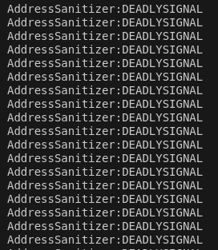
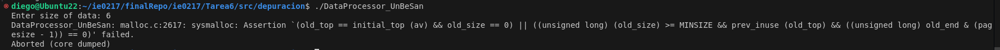

# Tarea 6 IE-0*17: Sistema de Administración en Paralelo y Depuración de Código

Para esta tarea se realizan dos ejercicios: la programación de un script en C++ de un sistema de administración de solicitudes en paralelo y la depuración de un código de C++ utilizando las herramientas GDB, Valgrind y los sanitizers de GCC.


## Insrucciones para correr el código

Considerando que se tiene instalado un compilador GCC para C++, lo primero es **situarse en la carpeta raíz _Tarea6_**. Ambos códigos se ejecutarán en orden, primero mostrando el menú para el manejo del árbol binario, y una vez se elige la opción de salir de ese programa se entra al programa de la lista enlazada de cancioness. Gracias al Makefile, solo es necesario un comando en línea para compilar cualquiera de los dos archivos:

Para correr el sistema de administración con programación en paralelo se ejecuta el siguiente comando
```bash
make sistema
```

Para correr el archivo depurado "DataProcessor.cpp" se ejecuta el siguiente comando
```bash
make dataP
```

## Análisis del Sistema de Administración de Solicitudes en Paralelo 

### Explicación del Uso de Mecanismos de Sincronización
**Uso de Mutex (`mtx` y `stats_mtx`)**

*Justificación*: El `mutex` (`mtx`) se usa para proteger el acceso concurrente al búfer compartido (`buffer`). Sin un `mutex`, múltiples hilos de clientes y operadores podrían acceder y modificar el búfer al mismo tiempo, causando condiciones de carrera, inconsistencias en los datos y potenciales fallos.

- `stats_mtx`: Este `mutex` protege el acceso a los vectores `tiempos_espera` y `tiempos_procesamiento` que almacenan las estadísticas de rendimiento. Dado que estos vectores son accesibles desde múltiples hilos (operadores), el `mutex` asegura que las operaciones de escritura en estos vectores no se interrumpan ni produzcan inconsistencias.

**Uso de Semáforos (`empty_slots` y `full_slots`)**

- `empty_slots`: Este semáforo de conteo permite a los clientes (productores) añadir elementos al búfer solo cuando hay espacio disponible (buffer no lleno). `empty_slots` se inicializa con el tamaño del búfer (`BUFFER_SIZE`), de modo que cada cliente adquiere un "slot vacío" antes de añadir una solicitud. Cuando un operador extrae una solicitud, libera un "slot vacío" permitiendo que otros clientes puedan agregar más elementos.

- `full_slots`: Similarmente, el semáforo `full_slots` permite que los operadores (consumidores) procesen solicitudes solo cuando el búfer contiene al menos un elemento. Este semáforo se inicializa en `0,` y cada vez que un cliente añade una solicitud al búfer, se incrementa el conteo de `full_slots`, lo cual permite a los operadores adquirir y procesar solicitudes en el orden correcto.

*Justificación*: Los semáforos permiten gestionar de forma eficiente la capacidad del búfer y sincronizar los productores y consumidores, evitando condiciones de sobrecarga (cuando el buffer está lleno) y subutilización (cuando el buffer está vacío).

**Uso de Variables de Condición (`cv_client` y `cv_operator`)**
- `cv_client`: Esta `condition_variable` se usa para notificar a los clientes cuando un operador ha liberado espacio en el búfer. Si el búfer estaba lleno y un cliente intentaba añadir una solicitud, podría esperar en esta variable de condición hasta que se le notifique que hay espacio disponible.

- `cv_operator`: Similarmente, esta variable de condición notifica a los operadores cuando una solicitud ha sido añadida al búfer. Si el búfer estaba vacío y un operador intentaba extraer una solicitud, podría esperar en esta variable de condición hasta recibir una notificación de que una solicitud está disponible.

*Justificación*: Las variables de condición se utilizan aquí para evitar la "espera activa", permitiendo que los hilos se duerman y se despierten solo cuando es necesario. Esto optimiza el uso de CPU y permite una mayor eficiencia en el procesamiento de solicitudes.

### Análisis de Escenarios con pruebas realizadas

Se realizan tres pruebas distintas:  1000 clientes y 1000 operadores, 1000 clientes y 100 operadores; y 100 clientes y 1000 operadores. 

**Variación del Tamaño del Búfer**

*Tamaño pequeño del búfer*: Con un búfer pequeño, los clientes podrían encontrar el búfer lleno con más frecuencia, lo que causaría que se bloqueen hasta que un operador procese una solicitud. Esto podría llevar a un bajo rendimiento del sistema debido a una mayor espera de los clientes. Un tamaño de búfer pequeño es adecuado solo si el número de clientes y operadores es pequeño y los tiempos de procesamiento son rápidos.

*Tamaño grande del búfer*: Con un búfer grande, el sistema permite que los clientes continúen agregando solicitudes sin bloquearse, incluso si los operadores están ocupados. Esto es útil en sistemas con muchos clientes, pero si el número de operadores es insuficiente, las solicitudes podrían acumularse, aumentando los tiempos de espera en el búfer.

**Variación del Número de Clientes**

*Mismos clientes que operadores*: Si el número de clientes es el mismo que el número de operadores, se espera que sea el caso donde la eficiencia es mayor en el programa, ya que no hay recursos desperdiciados y la relación entre clientes y operadores es de 1 a 1. Se realiza una prueba con 1000 clientes y 1000 operadores; los resultados se pueden observar en la siguiente imagen.


*Más clientes que operadores*: Si el número de clientes es significativamente mayor que el de operadores, habrá un mayor tiempo de espera en el búfer, ya que más solicitudes esperan a ser procesadas. En este caso, un tamaño de búfer mayor podría ayudar a mitigar las esperas de los clientes. Se realiza una prueba con 1000 clientes y 100 operadores; los resultados se pueden observar en la siguiente imagen.


*Menos clientes que operadores*: Si el número de clientes es bajo en comparación con los operadores, los operadores podrían encontrarse esperando a que lleguen nuevas solicitudes, lo cual reduciría la eficiencia general del sistema. Este escenario sería menos óptimo en términos de rendimiento, ya que los operadores estarían subutilizados. Se realiza una prueba con 100 clientes y 100 operadores; los resultados se pueden observar en la siguiente imagen.


En general, se notan variaciones en las respuestas, sin embargo, no son tan grandes. Esto se podría deber al poder de la máquina en la cual se está corriendo el sistema, o en el número de clientes y operadores, el cual tal vez siendo mayor podría generar resultados más contrastantes.

### Posibles Problemas y Soluciones
**Problemas Potenciales**
*Condiciones de Carrera*:

- *Problema*: Sin un adecuado control de sincronización, múltiples hilos podrían acceder y modificar el mismo recurso (como el búfer o las métricas) de manera simultánea, causando inconsistencias en los datos.
- *Solución*: Se implementaron `mutex` para proteger el acceso al búfer (`mtx`) y a las estadísticas (`stats_mtx`). Los `mutex` aseguran que solo un hilo pueda acceder y modificar estos recursos a la vez, evitando condiciones de carrera.

*Deadlocks*:

- *Problema*: Si los hilos de clientes y operadores se quedan esperando indefinidamente en una condición que nunca se cumple (por ejemplo, si `sistema_activo` se establece en `false` mientras los semáforos aún están en espera), podrían producirse bloqueos.
- *Solución*: La implementación verifica `sistema_activo` después de cada operación de sincronización (como `acquire()` y `wait()`) para asegurar que los hilos puedan salir de sus bucles de manera ordenada. Además, al finalizar `mostrar_metricas()`, se notifica a todos los hilos usando `cv_client.notify_all()` y `cv_operator.notify_all()`, asegurando que ningún hilo se quede bloqueado al terminar el sistema.

*Espera Activa*:

- *Problema*: Sin las variables de condición (`cv_client` y `cv_operator`), los hilos de clientes y operadores podrían intentar acceder al búfer en ciclos constantes, consumiendo CPU de forma innecesaria mientras esperan que haya espacio o solicitudes en el búfer.
- *Solución*: Las variables de condición permiten que los hilos se duerman hasta que las condiciones específicas se cumplan (como disponibilidad de espacio o de solicitudes en el búfer), optimizando el uso de CPU y reduciendo la espera activa.
Otros Aspectos de Sincronización y Rendimiento

*Justificación de Semáforos y Búferes Limitados*: Los semáforos (`empty_slots` y `full_slots`) y el tamaño del búfer aseguran que el sistema maneje correctamente la producción y el consumo de solicitudes sin saturar la memoria ni forzar a los posibles clientes a esperar innecesariamente.

*Escalabilidad*: El diseño actual permite ajustar el tamaño del búfer, el número de clientes y el número de operadores según las necesidades del sistema, ofreciendo flexibilidad para adaptarse a diferentes escenarios de carga.


## Análisis del Ejercicio de Depuración

### Resumen General del Programa

Este programa implementa una clase *DataProcessor* que gestiona un arreglo de enteros y permite realizar varias operaciones sobre él, las cuales están asignadas a las siguientes funciones:

- Inicializar valores en el arreglo (*populateData()*).
- Calcular la suma y el promedio de los elementos (*calculateSum()* y *calculateAverage()*).
- Procesar los datos concurrentemente en dos hilos que modifican el arreglo (*concurrentProcess()* y *processData()*).

## Tipos de Errores Encontrados
Al compilar y correr el código, se nota que no hay problema hasta que se ingresa un tamaño *size = 6*, el cual genera el siguiente error:


Durante el proceso de depuración, se identificaron los siguientes tipos de errores:

- **Errores de Acceso a Memoria:** Acceso fuera de los límites del arreglo debido a un bucle incorrecto en populateData().
- **Condiciones de Carrera:** Acceso concurrente al arreglo data en processData() sin protección de sincronización.
- **División por Cero:** Intento de división por cero en *calculateAverage()* cuando *size* es 0.
- **Posible Fuga de Memoria:** Se mejoró la gestión de memoria en main usando *std::unique_ptr* para evitar posibles problemas de liberación manual de memoria.

## Procedimiento de depuración

### Usando GDB

Con la herramienta GDB se busca identificar problemas de acceso a memoria y errores de lógica. Los comandos utilizados para revisar el código fueorn los siguientes:

```bash
# Compilar con información de depuración
g++ -g -o DataProcessor DataProcessor.cpp

# Iniciar GDB con el ejecutable
gdb ./DataProcessor

# Colocar breakpoints en funciones clave
(gdb) break main
(gdb) break DataProcessor::populateData
(gdb) break DataProcessor::processData
(gdb) break DataProcessor::calculateSum
(gdb) break DataProcessor::calculateAverage

# Ejecutar el programa en GDB
(gdb) run

# Inspeccionar variables
(gdb) print size
(gdb) print *data@size

# Ver flujo de llamadas si hay un error
(gdb) backtrace

# Salir de GDB
(gdb) q
```

Algunos de los resultados encontrados gracias a esta herramienta son los siguientes:


Gracias a esto se nota el error de que hay un error en la condición del ciclo for: el iterador *i* se sale del rango *size*, ya que se itera hasta que sea igual a size, sin embargo, la iteración correcta es hasta *size-1*, ya que el iterador toma en cuenta la i=0. Esto genera problemas porque en partes posteriores del código se intenta accesar a esa posición *i=size*, sin embargo, no existe.

### Usando Valgrind

Al utilizar esta herramienta, se espera verificar que no haya fugas de memoria o accesos indebidos. Se ejecuta el siguiente código para detectar fugas y accesos fuera de límites.

```bash
valgrind --leak-check=full --show-leak-kinds=all ./DataProcessor
```

Se obtiene lo siguiente:


Se nota que no hay fugas por pila, sin emabargo, hay un problema con el write de size. Se procede a ejecutar el análisis de la herramienta **Helgrind** para obtener más detalles del error:

```bash
valgrind --tool=helgrind ./DataProcessor
```


De nuevo se nota el problema en el bucle for, con el problema de que *i=size*.

### Usando Sanitizers de GCC

Se utilizan los siguientes sanitizers del compilador GCC para detectar problemas específicos en el uso de memoria, concurrencia y comportamientos indefinidos.

```bash
# Compilar con AddressSanitizer
g++ -g -o DataProcessor_ASan DataProcessor.cpp -fsanitize=address
./DataProcessor_ASan

# Compilar con ThreadSanitizer
g++ -g -o DataProcessor_TSan DataProcessor.cpp -fsanitize=thread
./DataProcessor_TSan

# Compilar con UndefinedBehaviorSanitizer
g++ -g -o DataProcessor_UBSan DataProcessor.cpp -fsanitize=undefined
./DataProcessor_UBSan
```

*Address Sanitizer:*



*Thread Sanitizer:*


*Undefined Behavior Sanitizer:*



## Corrección de errores

Acceso Fuera de los Límites en populateData()

Descripción: El bucle for en populateData() intentaba acceder a data[size], fuera de los límites válidos.
Corrección:
```cpp
void populateData() {
    for (int i = 0; i < size; ++i) {  // Cambiado de i <= size a i < size
        data[i] = i * 10;
    }
}
```
Justificación: Cambiar la condición a i < size evita accesos fuera del rango del arreglo data.
Condiciones de Carrera en processData()

Descripción: La función processData() accedía al arreglo data sin sincronización, provocando condiciones de carrera.
Corrección:
```cpp
void processData() {
    for (int i = 0; i < size; ++i) {
        std::lock_guard<std::mutex> lock(mtx);  // Se agregó un mutex para proteger el acceso a data
        data[i] *= 2;
    }
}
```
Justificación: El uso de std::lock_guard asegura que solo un hilo pueda modificar data a la vez.
División por Cero en calculateAverage()

Descripción: Si size era 0, calculateAverage() intentaba dividir por cero, causando un comportamiento indefinido.

Corrección:
```cpp
double calculateAverage() {
    if (size == 0) return 0.0;  // Se evita la división entre cero
    return static_cast<double>(calculateSum()) / size;
}
```
Justificación: La verificación if (size == 0) asegura que no se intente una división por cero.
Mejora en la Gestión de Memoria en main

Descripción: Se usó new y delete manualmente en main, lo cual es propenso a errores si delete se omite.
Corrección:
```cpp
int main() {
    int size;
    std::cout << "Enter size of data: ";
    std::cin >> size;

    auto processor = std::make_unique<DataProcessor>(size);  // Usa std::unique_ptr
    processor->populateData();
    processor->concurrentProcess();
    std::cout << "Average: " << processor->calculateAverage() << std::endl;

    return 0;
}
```

Justificación: std::unique_ptr gestiona automáticamente la liberación de memoria al salir del alcance.

## Parte Teórica

## 1.Diferencia entre un proceso y un hilo en programación

- Diferencias en el uso de memoria:
Los procesos tienen un espacio de memoria independiente, mientras que los hilos dentro de un mismo proceso comparten el espacio de memoria del proceso padre. Esto permite que los hilos sean más eficientes en términos de memoria.
- Tres características importantes de los procesos:
Ejecutan tareas en memoria independiente.
Necesitan comunicación inter-procesos (IPC) para intercambiar datos.
La creación de procesos es más costosa en términos de recursos.
- Tres características importantes de los hilos:
Comparten el mismo espacio de memoria y recursos del proceso.
La comunicación entre hilos es más rápida y directa.
Son más livianos y su creación es menos costosa que la de un proceso.
Multitarea y su implementación


## 2.¿Qué es la multitarea?
La multitarea es la capacidad del sistema para ejecutar múltiples tareas en un período de tiempo, dando la impresión de ejecución simultánea.
¿Se realiza de manera paralela o concurrente?
Puede realizarse de ambas formas, dependiendo del hardware. En un sistema de un solo núcleo, es concurrente; en uno de múltiples núcleos, puede ser paralela.
a. Ejemplo de uso de multitarea:
Un sistema operativo que permite al usuario trabajar en un procesador de texto mientras escucha música.
b. Mecanismos de comunicación en multitarea:
Semáforos, colas de mensajes y variables de condición son mecanismos comunes para gestionar la comunicación en multitarea.


## 3.Generación de procesos paralelos en una computadora

a. División de tareas en paralelo:
Las tareas se dividen en sub-tareas que se asignan a distintos núcleos o hilos. Las sub-tareas deben ser lo más independientes posible para minimizar la sincronización y maximizar el paralelismo.
b. Factores que afectan la eficiencia de procesos paralelos:
La cantidad de núcleos, la necesidad de sincronización, el balance de carga y el acceso a memoria son factores determinantes para la eficiencia en paralelismo.


## 4.Funcionamiento de tareas concurrentes

a. Mecanismos de sincronización en tareas concurrentes:
Los mutex, semáforos y variables de condición son mecanismos que permiten coordinar el acceso concurrente a recursos compartidos.
b. Desafíos comunes de la programación concurrente:
Deadlocks, condiciones de carrera y la gestión de recursos compartidos son problemas habituales en concurrencia.


## 5.Diferencias entre multinúcleo y multiprocesador:

Un sistema multinúcleo posee múltiples núcleos en un solo chip, mientras que un multiprocesador incluye varios chips de CPU en el sistema, cada uno con uno o más núcleos.


## 6.Diferencias entre memoria compartida y distribuida:

La memoria compartida permite que múltiples procesos accedan a la misma ubicación de memoria, mientras que la memoria distribuida implica que cada nodo en un sistema tiene su propio espacio de memoria, requiriendo comunicación explícita.


## 7.Condición de carrera:

Es una situación en la que el resultado del programa depende del orden en que los hilos acceden a los datos compartidos, lo que puede generar comportamientos impredecibles.


## 8.Mecanismos para evitar condiciones de carrera en memoria compartida

- Mutex: Restringe el acceso simultáneo a la sección crítica a un solo hilo.
- Semáforos: Controlan el acceso a recursos con varios hilos, limitando el número de hilos que pueden acceder.
- Variables de condición: Coordinan la ejecución de hilos, permitiendo que uno espere hasta que una condición específica sea verdadera.


## 9.Modelos de memoria compartida vs. paso de mensajes

En memoria compartida, los hilos comparten el espacio de memoria. En paso de mensajes, los hilos o procesos se comunican enviando datos explícitamente.


## 10.Mecanismos de sincronización en C++

Mutex: std::mutex para evitar acceso simultáneo a datos compartidos.
Lock Guard: std::lock_guard para la administración de bloqueo automático.
Variable de Condición: std::condition_variable para coordinar la sincronización.
Semáforo Contado: std::counting_semaphore para gestionar múltiples accesos.


## 11.Costos de administración y creación de hilos

a. Recursos del sistema: Procesador, memoria, tiempo de CPU y mecanismos de sincronización.
b. Estrategias de optimización: Uso de pool de hilos, minimizar la creación y destrucción de hilos, y gestionar la afinidad de los hilos.


## 1222.Ventajas de usar herramientas de depuración

Identificar errores rápidamente, comprender el flujo del programa y optimizar el uso de recursos.


## 13.Breakpoint en un entorno de depuración

Punto de interrupción que permite detener la ejecución en un lugar específico para examinar el estado del programa.


## 14.Stepping en depuración

Tipos de stepping:
- Step Over: Ejecuta la función actual sin entrar en sus detalles.
- Step Into: Entra en la función actual para depurar su ejecución.
- Step Out: Sale de la función actual, retomando la ejecución en el nivel superior.


## 15.Cinco comandos de GDB

- break: Establece un punto de interrupción.
- run: Inicia el programa.
- next: Avanza una línea.
- print: Imprime el valor de una variable.
- continue: Continúa la ejecución hasta el próximo breakpoint.


## 16.Valgrind y su conveniencia

Valgrind es una herramienta que permite detectar errores de memoria. Memcheck es una herramienta específica de Valgrind para identificar accesos indebidos a memoria.


## 17.Uso de AddressSanitizer y ThreadSanitizer

- AddressSanitizer: Detecta accesos fuera de los límites de memoria.
- ThreadSanitizer: Detecta errores en la concurrencia.


## 18.Paralelismo a nivel de datos vs. a nivel de tareas

- Datos: Divide datos en bloques independientes. Ejemplo: procesamiento de imágenes en bloques.
- Tareas: Divide funciones. Ejemplo: un hilo para entrada de datos y otro para procesamiento.


## 19.Balanceo de carga en sistemas paralelos

Distribuir las tareas equitativamente entre los núcleos. Un mal balanceo lleva a una menor eficiencia.


## 20.Orden de ejecución de los hilos en concurrencia

Problemas como condiciones de carrera y deadlocks surgen sin un orden adecuado, lo que puede generar errores de sincronización.


## 21.Barreras en programación paralela

Una barrera sincroniza hilos en puntos específicos. Ejemplo: sincronización al finalizar el cálculo de una iteración.


## 22.Identificación de fugas de memoria

Herramientas como Valgrind permiten detectar estos problemas.


## 23.Uso de semáforos y su impacto

Los semáforos regulan el acceso a recursos compartidos. Un semáforo binario limita a un hilo, mientras que uno contado permite un número definido de accesos.


## 24.Herramienta para detectar accesos indebidos a memoria

AddressSanitizer detecta accesos inválidos como desbordamientos de búfer o memoria no inicializada.


## 25.Detección de uso de memoria liberada

Valgrind permite identificar errores de uso de memoria después de ser liberada.


## 26.Detección de comportamientos inesperados en programas multihilo

ThreadSanitizer y Valgrind (con Helgrind) son herramientas útiles para analizar bloqueos o deadlocks.

