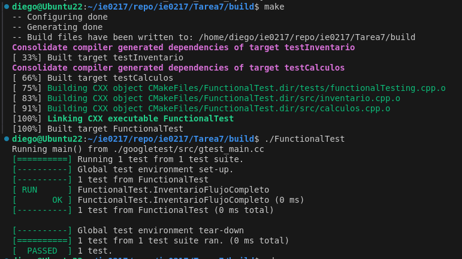
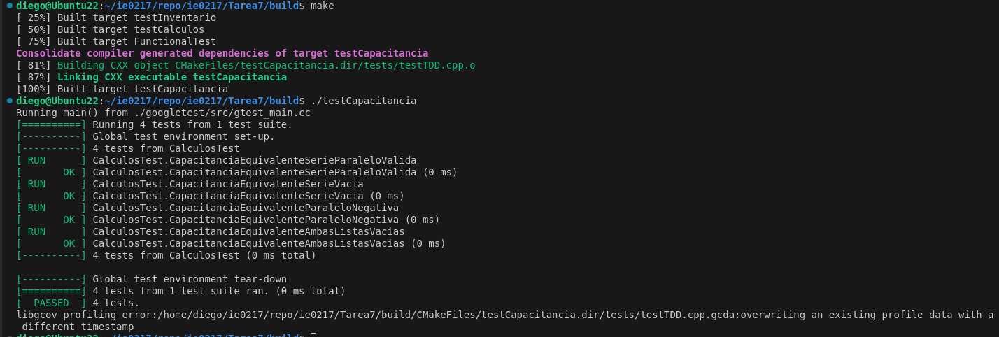
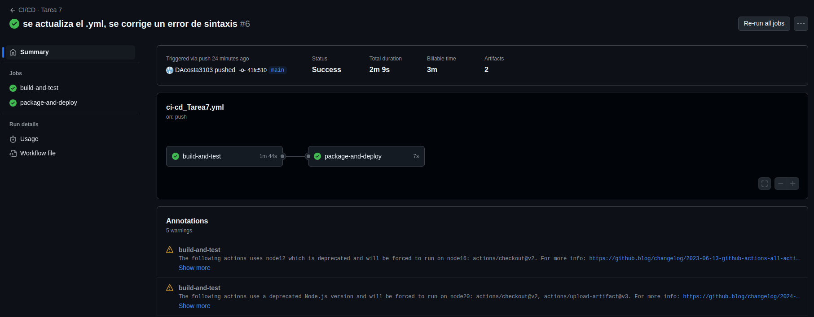
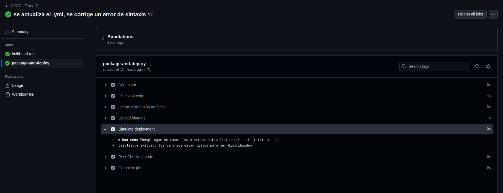

# Tarea 7 IE-0217: Pruebas Automatizadas y Continuous Integration en el Desarrollo de Software

Para esta tarea se realiza un script para añadir componentes eléctricos referentes a cada impedancia (Resistor, Capacitor, Inductor), así como la habilidad de calcular el valor de la impedancia equivalente al sumar estas en serie o paralelo. Cabe destacar que no es posible sumar impedancias de categorías distintas. 

Seguidamente, se le realizan tests de software al script con las distintas herramientas vistas en clase:
- Google Test
- Code Coverage (lcov)
- Github Actions

Para facilitar la revisión de este trabajo por parte de la asistente, se realiza un pequeño menú para probar todas las opciones de ambos scripts `inventario.cpp` y `calculos.cpp`.
## Cómo correr el código


Considerando que se tiene instalado un compilador GCC para C++, lo primero es **situarse en la carpeta raíz _Tarea7_**.  Gracias al Makefile, solo es necesario un comando en línea para compilar ambos scripts:

```bash
make 
```


## Explicación del Software Testing

### Google Test
 
Primero, se realizan archivos de testing en C++, utilizando Google Test. Un código de ejemplo para la prueba de validación del método *agregarComponente*, donde se agrega una resistencia al inventario y luego se añaden más de esa misma, es el siguiente:

```cpp
// Se prueba el caso donde se agrega un componente y luego una mayor cantidad del mismo componente
TEST(InventarioTest, AgregarCantidadExistente) {
    Inventario inventario;
    inventario.agregarComponente(`Resistencia`, `Resistencia`, 10, `Resistencia de 10 ohms`);
    inventario.agregarComponente(`Resistencia`, `Resistencia`, 5, `Resistencia de 10 ohms`);

    testing::internal::CaptureStdout();
    inventario.listarComponentes();
    string output = testing::internal::GetCapturedStdout();
    
    // Se espera que la cantidad final sea de 15
    EXPECT_NE(output.find(`Cantidad: 15`), string::npos);
}
```

Algunas otras pruebas para _inventario_ y _calculos_, son las siguientes:
- Reducir la cantidad de componentes en el inventario
- Reducir una cantidad de componentes dle inventario de tal forma que la cantidad resultante sea negativa (inválida)
- Buscar un componente que no existe en el inventario
- Capacitancias en paralelo con argumentos invalidos
- Prueba válida para el método de sumar resistencias en serie
- El manejo del error de lista vacía (no se brindaron argumentos para los valores de las resistencias, capacitancias, etc.)

entre otras.

El procedimiento segiudo para compilar los archivos ejecutables utilizando el archivo *CMakelists.txt* se realiza desde la carpeta raíz _Tarea7_. Los comandos utilizados para la terminal son los siguientes:

```bash
mkdir build 
cd build
cmake ..
make
```

Al compilar todo con el archivo *CMakefile.txt*, se generan dos ejecutables para el testing: *testCalculos* y *testInventario*. El resultado de ejecutar estos archivos para validar las pruebas de ambos scripts de testing se puede notar en las dos siguientes imágenes:


Pruebas exitosas para calculos.cpp


Pruebas exitosas para inventario.cpp


Se nota que las pruebas realizadas fueron exitosas, por lo que se testea y debuggea correctamente el código. 

### Code Coverage

Luego de correr los archivos test generados, se procede a trabajar el code coverage para el script, utilizando `lcov`. Para generar el reporte, se actualiza el archivo `CMakeLists.txt` para habilitar la cobertura de código, y se procede con los siguientes comandos en terminal dentro de la carpeta *build*:

```bash
# Se capturan los datos con lcov
lcov --capture --directory . --output-file coverage.info  

# Se filtran archivos no relevantes
lcov --remove coverage.info '/usr/*' '*/tests/*' --output-file coverage.filtered.info

# Se genera el reporte en formato HTML
genhtml coverage.filtered.info --output-directory coverage-report

# Se visualiza el reporte, en este caso para Linux
xdg-open coverage-report/index.html
```

Los resultados del reporte se notan en la siguiente imagen:


Las líneas no cubiertas por pruebas se notan en esta imagen:


Para cubrir estas líneas, de manera que se pueda tener un 100% de cobertura en el código, solo sería necesario agregar dos pruebas:
- Prueba para añadir una cantidad menor o igual a cero de algún componente
- Prueba para reducir una cantidad de un componente que no existe en el inventario

### Functional Testing

Se realiza una prueba funcional para probar el flujo correcto del script de `inventario.cpp`. La prueba sigue los siguientes pasos:

```cpp
// Paso 1: Agregar componentes y verificar que los componentes se agregaron correctamente

// Paso 2: Reducir una cantidad válida


// Paso 3: Intentar reducir una cantidad inválida (más de lo disponible)

// Paso 4: Verificar que el inventario final es correcto

// Paso 5: Buscar un componente en específico

```
Se espera que la prueba de resultados positivos, en el sentido de que las pruebas funcionen correctamente y se testee bien el script.



### Test-Driven Development

Primero se realiza un script para un simple testing con una prueba para cada método referente a las capacitancias: 
- Combinación de capacitancias en serie
- Combinación de capacitancias en paralelo
- Combinación de capacitancais en serie y paralelo

Seguidamente, se implemente una nueva función `capacitanciaEquivalenteSerieParalelo` en el archivo `calculos.cpp`, la cual se ve así:

```cpp
double Calculos::capacitanciaEquivalenteSerieParalelo(const vector<double>& serie, const vector<double>& paralelo) {
    validarValores(serie);
    validarValores(paralelo);

    double serieEq = capacitanciaSerie(serie);
    double paraleloEq = capacitanciaParalelo(paralelo);

    // Combinar serie y paralelo (asumimos que están en paralelo)
    return serieEq + paraleloEq;
}
```

Entonces, se le brindan dos listas de datos a la función: los valores de las capacitancias en serie y en paralelo. Las pruebas realizadas se nombran a continuación:
- Prueba válida para capacitancia equivalente combinada en serie y paralelo
- Prueba con una lista vacía para serie
- Prueba con valores negativos en paralelo
- Prueba con ambas listas vacías

Las pruebas se pasan con éxito, como se nota en la imagen:


### Github Actions

#### **1. Continuous Integration (CI)**

El flujo de trabajo de CI realiza lo siguiente:
1. **Instalación de Dependencias:**
   - Descarga e instala herramientas necesarias como `CMake`, `GoogleTest` y `LCOV`.
   - Clona el repositorio de GoogleTest para ejecutar las pruebas unitarias.

2. **Compilación del Proyecto:**
   - Compila los archivos fuente del proyecto junto con los tests utilizando `CMake`.

3. **Ejecución de Pruebas Unitarias:**
   - Ejecuta los binarios generados de las pruebas unitarias (`testInventario`, `testCalculos`, etc.).
   - Asegura que todas las pruebas pasen exitosamente.

4. **Reporte de Cobertura de Código:**
   - Genera un reporte de cobertura de código utilizando `LCOV`.
   

##### **Artefactos Generados por CI:**
- **coverage-report:** Contiene un reporte HTML que detalla la cobertura de código del proyecto.

---

#### **2. Continuous Delivery (CD)**

El flujo de trabajo de CD realiza lo siguiente:
1. **Empaquetado de Binarios:**
   - Los binarios generados (como `testInventario`, `testCalculos`, etc.) se comprimen en un archivo `.tar.gz` para su distribución.

2. **Subida de Binarios como Artefactos:**
   - El archivo comprimido con los binarios se sube como artefacto descargable en GitHub Actions bajo el nombre `Tarea7-binaries`.

3. **Simulación de Despliegue:**
   - Al final del flujo, se imprime el siguiente mensaje en los logs de **GitHub Actions**:
     `Despliegue exitoso: los binarios están listos para ser distribuidos.`

##### **Artefactos Generados por CD:**
- **Tarea7-binaries:** Archivo comprimido `.tar.gz` que contiene los binarios del proyecto.

---

#### **3. Configuración del Workflow**

El pipeline está configurado en el archivo `.github/workflows/ci_cd_Tarea7.yml`. A continuación, se describen las etapas principales:

##### **build-and-test**
1. **Checkout del Código:**
   Clona el repositorio.
2. **Instalación de Dependencias:**
   Instala herramientas como `CMake`, `GoogleTest` y `LCOV`.
3. **Compilación:**
   Compila el proyecto y genera binarios para las pruebas.
4. **Ejecución de Pruebas:**
   Ejecuta las pruebas unitarias generadas.
5. **Generación de Reporte de Cobertura:**
   Genera un reporte de cobertura de código en formato HTML.

##### **package-and-deploy**
1. **Empaquetado:**
   Comprime los binarios generados en un archivo `.tar.gz`.
2. **Subida de Binarios:**
   Sube el archivo comprimido como artefacto descargable.
3. **Simulación de Despliegue:**
   Imprime un mensaje indicando que el despliegue fue exitoso.


Como se puede ver en las siguientes imágenes, el proceso realizado por github actions fue exitoso, de tal forma que ambos dan "Success!", y se genera el mensae de éxito **"Los binarios están listos para ser distribuidos"**.





Ahora bien, para implementar este flujo en un proyecto real se podría realizar lo siguiente:
1. **Automatización de Despliegue Real:**
   - Modifica el paso "Simulate deployment" para realizar una acción real, como copiar binarios a un servidor o ejecutar un script de despliegue.

2. **Notificaciones:**
   - Añade integraciones para notificar al equipo (por ejemplo, usando Slack o correo) cuando el despliegue sea exitoso.

3. **Personalización:**
   - Adapta el pipeline a las necesidades específicas del proyecto, como configuraciones adicionales de compilación o pruebas de integración.


## Parte Teórica


## **1. ¿Qué es la Integración Continua (CI)?**
La **Integración Continua (CI)** es una práctica de desarrollo de software que automatiza la integración y validación del código de manera frecuente. Implica realizar pruebas automáticas para detectar errores en etapas tempranas del ciclo de desarrollo.

[Referencia](https://www.ibm.com/topics/software-testing#:~:text=Software%20testing%20is%20the%20process,ensure%20it%20meets%20user%20requirements)

## **2. ¿Por qué es importante la Integración Continua?**
Es importante porque:
- Detecta errores temprano, reduciendo costos y tiempo de corrección.
- Automatiza las pruebas, mejorando la eficiencia del equipo.
- Promueve la colaboración al integrar el trabajo de múltiples desarrolladores de forma regular.
- Asegura que el código siempre esté en un estado funcional y probado.

[Referencia](https://www.ibm.com/topics/software-testing#:~:text=Software%20testing%20is%20the%20process,ensure%20it%20meets%20user%20requirements)

## **3. ¿Qué es la Entrega Continua (CD)?**
La **Entrega Continua (CD)** es una extensión de la CI que automatiza la preparación y entrega de software en entornos de producción o pruebas. Garantiza que cada cambio validado pueda ser desplegado de manera confiable.

[Referencia](https://www.ibm.com/topics/software-testing#:~:text=Software%20testing%20is%20the%20process,ensure%20it%20meets%20user%20requirements)

## **4. ¿Por qué es importante la Entrega Continua?**
Es importante porque:
- Permite realizar despliegues más rápidos y confiables.
- Asegura que el software funcione correctamente en entornos reales antes de llegar a producción.
- Facilita la entrega frecuente de nuevas características y correcciones.
- Mejora el tiempo de comercialización del software.

[Referencia](https://www.ibm.com/topics/software-testing#:~:text=Software%20testing%20is%20the%20process,ensure%20it%20meets%20user%20requirements)

## **5. Diferencias entre CI y CD**

| **Aspecto**            | **Integración Continua (CI)**                | **Entrega Continua (CD)**                     |
|-------------------------|----------------------------------------------|-----------------------------------------------|
| **Objetivo**            | Automatizar la integración y validación del código. | Automatizar el empaquetado y despliegue del sistema. |
| **Enfoque**             | Validar que los cambios en el código no rompan el sistema. | Preparar y entregar software listo para desplegar. |
| **Desencadenante**      | Cada commit o pull request.                  | Después de pasar las pruebas de CI.           |
| **Resultado Principal** | Código probado y funcional.                  | Binarios empaquetados listos para despliegue. |

[Referencia](https://www.ibm.com/topics/software-testing#:~:text=Software%20testing%20is%20the%20process,ensure%20it%20meets%20user%20requirements)

## **6. ¿Qué es un pipeline de CI/CD?**
Un pipeline de CI/CD es una secuencia automatizada de pasos para integrar, probar, empaquetar y desplegar software. Permite implementar CI/CD de manera estructurada, dividiendo tareas como:
- Clonación del repositorio.
- Instalación de dependencias.
- Ejecución de pruebas.
- Generación de artefactos y despliegue.

[Referencia](https://about.gitlab.com/es/topics/ci-cd/cicd-pipeline/)

## **7. ¿Qué herramientas de CI/CD existen?**
Algunas herramientas populares son:
- **GitHub Actions**: Integrada en GitHub para configurar flujos de CI/CD.
- **Jenkins**: Herramienta de código abierto altamente personalizable.
- **GitLab CI/CD**: Parte de la plataforma GitLab para CI/CD completo.
- **CircleCI**: Enfocada en pipelines rápidos y simples.
- **Travis CI**: Muy utilizada en proyectos de código abierto.

[Referencia](https://about.gitlab.com/es/topics/ci-cd/cicd-pipeline/)

## **8. ¿Qué es GitHub Actions?**
GitHub Actions es una herramienta de CI/CD integrada en GitHub que permite automatizar flujos de trabajo en repositorios. Es ideal para ejecutar pruebas, generar artefactos y realizar despliegues en cada commit o pull request.

[Referencia](https://about.gitlab.com/es/topics/ci-cd/cicd-pipeline/)

## **9. ¿Cómo se integra GitHub Actions en un proyecto?**
1. Crear un archivo YAML en `.github/workflows/` que defina los pasos del flujo de trabajo.
2. Configurar triggers como `push` o `pull_request`.
3. Definir los jobs que ejecutarán las tareas, como instalar dependencias, compilar el código y ejecutar pruebas.

[Referencia](https://about.gitlab.com/es/topics/ci-cd/cicd-pipeline/)

## **10. ¿Qué es un artefacto en CI/CD?**
Un artefacto es un archivo o conjunto de archivos generados durante un pipeline de CI/CD. Ejemplos:
- Binarios compilados.
- Reportes de cobertura de código.
- Archivos comprimidos para distribución.

[Referencia](https://about.gitlab.com/es/topics/ci-cd/cicd-pipeline/)

## **11. ¿Cómo se generan artefactos en GitHub Actions?**
En GitHub Actions, los artefactos se generan utilizando la acción `upload-artifact`. Por ejemplo:

"yaml"
- name: Upload coverage report
  uses: actions/upload-artifact@v3
  with:
    name: coverage-report
    path: build/coverage-report
"

[Referencia](https://about.gitlab.com/es/topics/ci-cd/cicd-pipeline/)

## **12. ¿Qué es la cobertura de código?**
La cobertura de código mide qué porcentaje del código fuente es ejecutado durante las pruebas. Ayuda a identificar partes del código que no están probadas.

[Referencia](https://medium.com/@xianpeng.shen/use-gcov-and-lcov-to-perform-code-coverage-testing-for-c-c-projects-c85708b91c78)

## **13. ¿Qué herramientas existen para medir cobertura de código?**
- **LCOV**: Herramienta para capturar y generar reportes de cobertura en proyectos C/C++.
- **Codecov**: Servicio para integración de cobertura con reportes gráficos.
- **SonarQube**: Analiza la calidad del código y la cobertura.

[Referencia](https://medium.com/@xianpeng.shen/use-gcov-and-lcov-to-perform-code-coverage-testing-for-c-c-projects-c85708b91c78)

## **14. ¿Cómo se genera un reporte de cobertura con LCOV?**
1. Ejecutar pruebas para generar datos de cobertura.
2. Usar `lcov` para capturar cobertura:
   "bash"
   lcov --capture --directory . --output-file coverage.info
   "
3. Filtrar archivos no deseados:
   "bash"
   lcov --remove coverage.info '/usr/*' --output-file filtered.info
   "
4. Generar un reporte HTML con `genhtml`:
   "bash"
   genhtml filtered.info --output-directory coverage-report
   "

[Referencia](https://medium.com/@xianpeng.shen/use-gcov-and-lcov-to-perform-code-coverage-testing-for-c-c-projects-c85708b91c78)

## **15. ¿Cómo se implementó CI/CD en este proyecto?**
1. **Integración Continua:**
   - Instalación de dependencias (CMake, LCOV, GoogleTest).
   - Compilación del proyecto.
   - Ejecución de pruebas unitarias.
   - Generación de un reporte de cobertura.

2. **Entrega Continua:**
   - Empaquetado de binarios en un archivo `.tar.gz`.
   - Subida de artefactos (binarios y reporte de cobertura).
   - Simulación de despliegue exitoso mediante logs.

[Referencia](https://medium.com/@xianpeng.shen/use-gcov-and-lcov-to-perform-code-coverage-testing-for-c-c-projects-c85708b91c78)

## **16. ¿Cuáles son los beneficios de implementar CI/CD en este proyecto?**
1. **Automatización:** Reduce errores humanos al automatizar pruebas y despliegues.
2. **Confiabilidad:** Garantiza que cada cambio pase por pruebas antes de ser integrado.
3. **Velocidad:** Permite ciclos de desarrollo y entrega más rápidos.
4. **Documentación:** Los artefactos y logs facilitan el seguimiento del proyecto.
5. **Escalabilidad:** El código se vuelve más escalable, ya que la parte de software testing se encarga del "trabajo sucio", uno como programador puede solo agregar más cosas.


