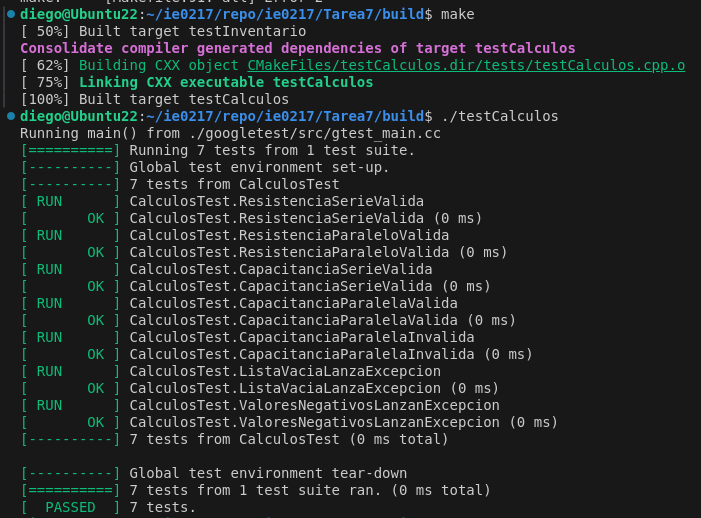
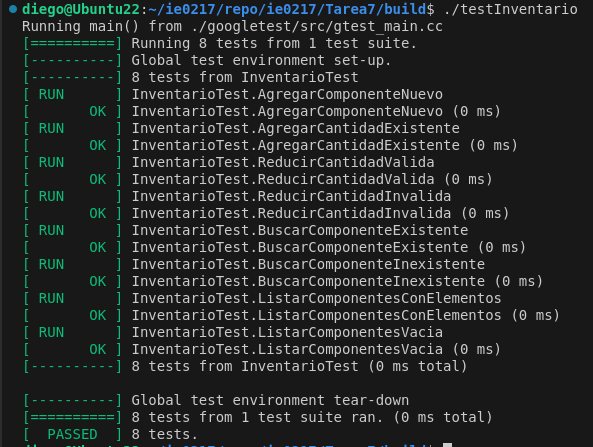
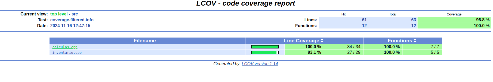
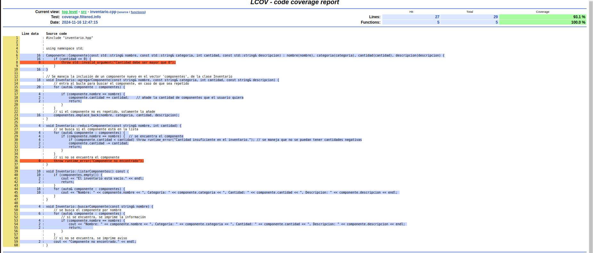

# Tarea 7 IE-0217: Pruebas Automatizadas y Continuous Integration en el Desarrollo de Software

Para esta tarea se realiza un script para añadir componentes eléctricos referentes a cada impedancia (Resistor, Capacitor, Inductor), así como la habilidad de calcular el valor de la impedancia equivalente al sumar estas en serie o paralelo. Cabe destacar que no es posible sumar impedancias de categorías distintas. 

Seguidamente, se le realizan tests de software al script con las distintas herramientas vistas en clase:
- Google Test
- Code Coverage (lcov)
- Github Actions


## Cómo correr el código


## Explicación del Software Testing

### Google Test
 
Primero, se realizan archivos de testing en C++, utilizando Google Test. Un código de ejemplo para la prueba de validación del método *agregarComponente*, donde se agrega una resistencia al inventario y luego se añaden más de esa misma, es el siguiente:

```cpp
// Se prueba el caso donde se agrega un componente y luego una mayor cantidad del mismo componente
TEST(InventarioTest, AgregarCantidadExistente) {
    Inventario inventario;
    inventario.agregarComponente("Resistencia", "Resistencia", 10, "Resistencia de 10 ohms");
    inventario.agregarComponente("Resistencia", "Resistencia", 5, "Resistencia de 10 ohms");

    testing::internal::CaptureStdout();
    inventario.listarComponentes();
    string output = testing::internal::GetCapturedStdout();
    
    // Se espera que la cantidad final sea de 15
    EXPECT_NE(output.find("Cantidad: 15"), string::npos);
}
```

Algunas otras pruebas para _inventario_ y _calculos_, son las siguientes:
- Reducir la cantidad de componentes en el inventario
- Reducir una cantidad de componentes dle inventario de tal forma que la cantidad resultante sea negativa (inválida)
- Buscar un componente que no existe en el inventario
- Capacitancias en paralelo con argumentos invalidos
- Prueba válida para el método de sumar resistencias en serie
- El manejo del error de lista vacía (no se brindaron argumentos para los valores de las resistencias, capacitancias, etc.)

entre otras.

El procedimiento segiudo para compilar los archivos ejecutables utilizando el archivo *CMakelists.txt* se realiza desde la carpeta raíz _Tarea7_. Los comandos utilizados para la terminal son los siguientes:

```bash
mkdir build 
cd build
cmake ..
make
```

Al compilar todo con el archivo *CMakefile.txt*, se generan dos ejecutables para el testing: *testCalculos* y *testInventario*. El resultado de ejecutar estos archivos para validar las pruebas de ambos scripts de testing se puede notar en las dos siguientes imágenes:


Pruebas exitosas para calculos.cpp



Pruebas exitosas para inventario.cpp



Se nota que las pruebas realizadas fueron exitosas, por lo que se testea y debuggea correctamente el código. 

### Code Coverage

Luego de correr los archivos test generados, se procede a trabajar el code coverage para el script, utilizando `lcov`. Para generar el reporte, se actualiza el archivo `CMakeLists.txt` para habilitar la cobertura de código, y se procede con los siguientes comandos en terminal dentro de la carpeta *build*:

```bash
# Se capturan los datos con lcov
lcov --capture --directory . --output-file coverage.info  

# Se filtran archivos no relevantes
lcov --remove coverage.info '/usr/*' '*/tests/*' --output-file coverage.filtered.info

# Se genera el reporte en formato HTML
genhtml coverage.filtered.info --output-directory coverage-report

# Se visualiza el reporte, en este caso para Linux
xdg-open coverage-report/index.html
```

Los resultados del reporte se notan en la siguiente imagen:



Las líneas no cubiertas por pruebas se notan en esta imagen:


Para cubrir estas líneas, de manera que se pueda tener un 100% de cobertura en el código, solo sería necesario agregar dos pruebas:
- Prueba para añadir una cantidad menor o igual a cero de algún componente
- Prueba para reducir una cantidad de un componente que no existe en el inventario


## Parte Teórica